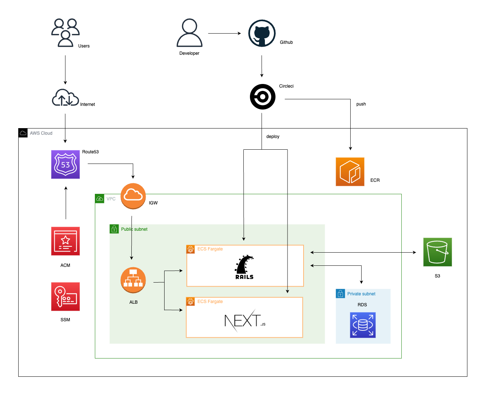
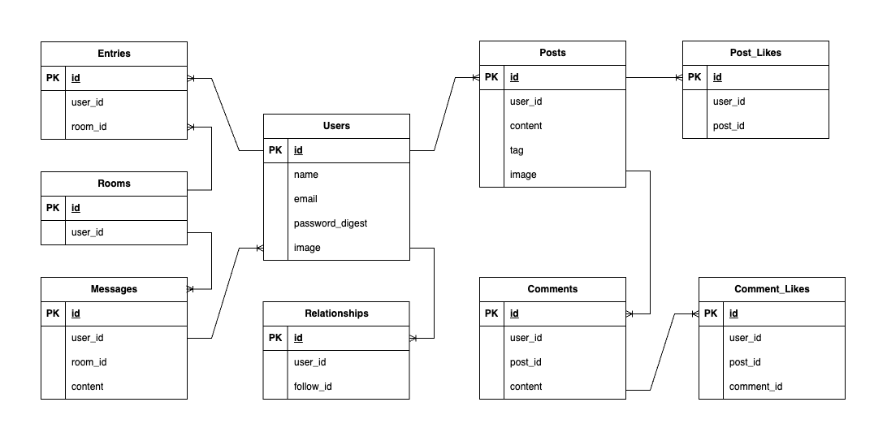

# Gog

# インフラ構成図

# ER図

# 使用技術
* バックエンド  
  * Ruby 2.7.2
  * Ruby on Rails 6.0.3 （APIモード）
  * RSpec（テスト）
  * MySQL(DB)
* フロントエンド 
  * Next.js 12.1.6 （CSR）
  * TypeScript 
  * TailwindCSS
  * Jest（テスト）
* インフラ・開発環境  
  * Docker/Docker-compose
  * AWS（ECR,ECS,ALB,VPC,S3,Route53,RDS,ACM,SSM）
  * Terraform（インフラのコード管理）
  * CircleCI（CI/CD）

# 機能一覧
* 新規登録・ログイン/ゲストログイン
* 投稿機能（作成・削除）
　　　　* 指定したタグがある投稿のみ表示可
* コメント機能（作成・削除）
* いいね機能（作成・削除）
* ユーザー検索機能
* フォロー機能（作成・削除）
* DM機能（作成・削除）
