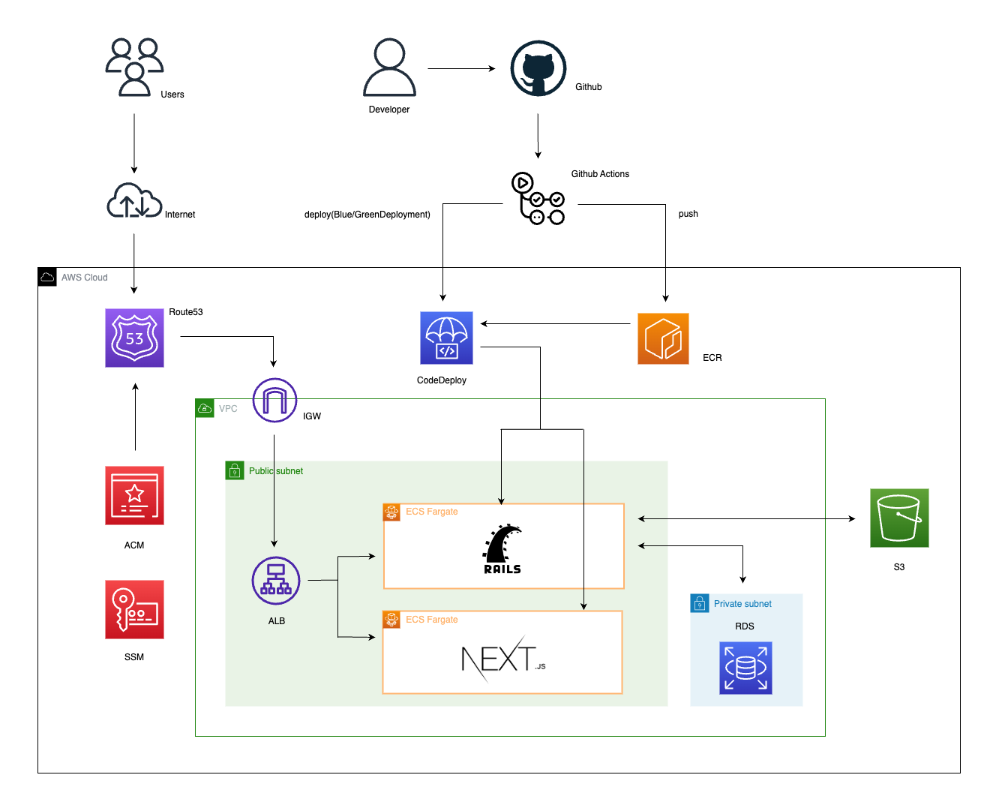

# Gogとは

Gogとは、ゲーマー同士が主にフレンド募集・メッセージのやり取りなどの交流を行うことができるサービスです。

{:target="_blank"} (ゲストログインも可能です)

# インフラ構成図

# ER図

# 使用技術
* バックエンド  
  * Ruby 2.7.2
  * Ruby on Rails 6.0.3 （APIモード）
  * RSpec （テスト）
  * MySQL (DB)
* フロントエンド 
  * React 18.1.0
  * Next.js 12.1.6 （CSR）
  * TypeScript 
  * TailwindCSS
  * Jest, React Testing Library （テスト）
* インフラ・開発環境  
  * Docker/Docker-compose
  * AWS （ECR,ECS,ALB,VPC,S3,Route53,RDS,ACM,SSM）
  * Terraform （インフラのコード管理）
  * CircleCI （CI/CD）

# 機能一覧
* 新規登録・ログイン/ゲストログイン
* プロフィール編集機能 （プロフィール画像）
* 投稿機能 （作成・削除）
  * タグ選択可
  * 指定したタグがある投稿のみ表示可
* コメント機能 （作成・削除）
* いいね機能 （作成・削除）
  * 投稿とコメントに対してのいいねがある
* ユーザー検索機能
  * 検索にヒットしたユーザーのプロフィールページへ遷移可
* フォロー機能 （作成・削除）
  * ユーザーがフォローしたらDM用のルームを作成
* DM機能 （作成・削除）
  * 作成されたルーム内でメッセージのやり取り可
* フラッシュメッセージ機能
* レスポンシブ対応
